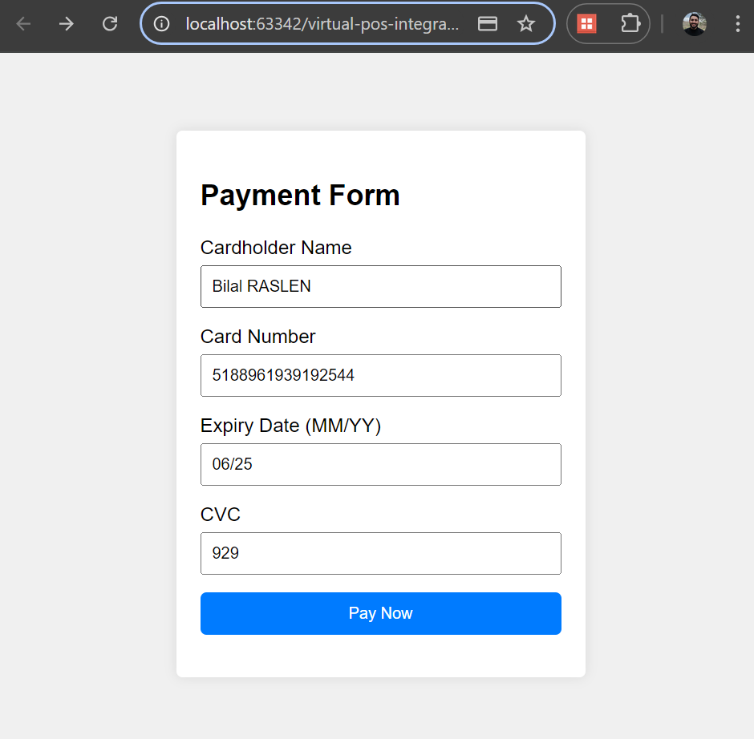
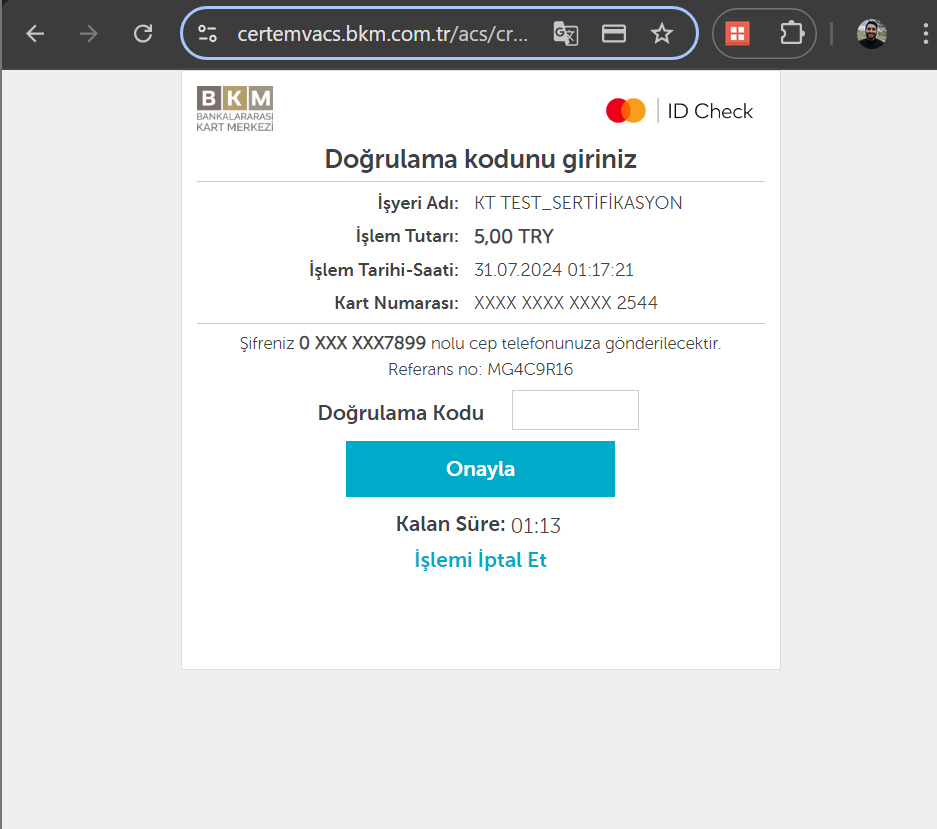
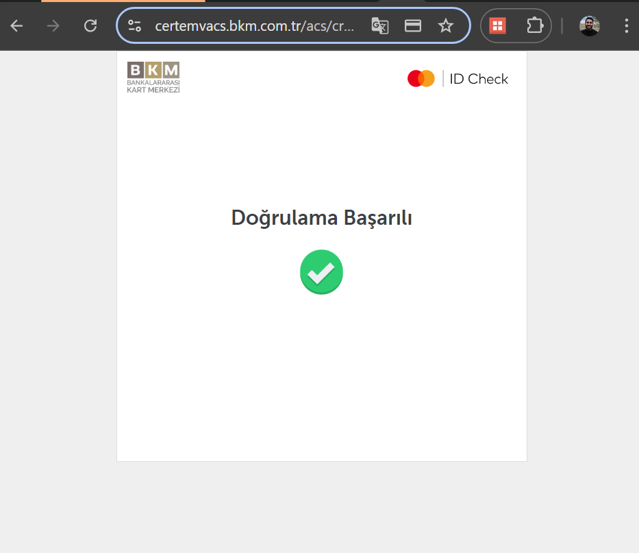
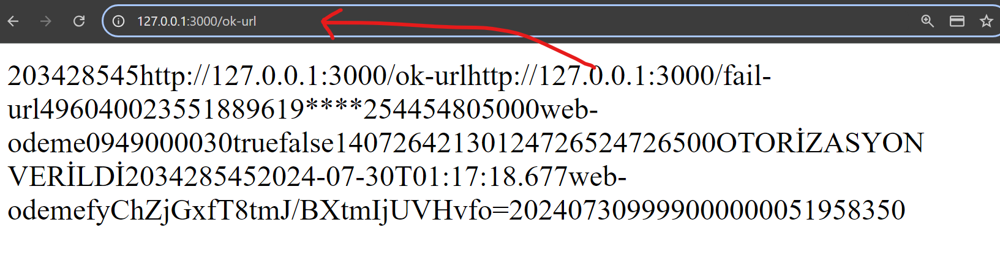
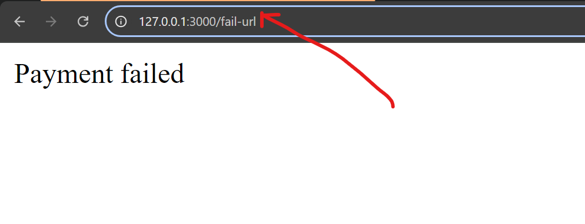

# Kuveyt Türk Virtual POS Integration (Node.js)

This repository provides a Node.js application for integrating with Kuveyt Türk's virtual POS service. It allows you to accept online payments securely using credit cards.
## Demo
### 1

### 2

### 3

### 4

### 5


## Requirements

- Node.js and npm
- Kuveyt Türk virtual POS merchant account

## Installation

1. **Clone this repository:**

    ```bash
    git clone https://github.com/your-username/kuveyt-turk-vpos.git
    ```

2. **Install dependencies:**

    ```bash
    cd kuveyt-turk-vpos
    npm install
    ```

## Configuration

Update the `SANAL_POS` object in `controllers/paymentController.js` with your Kuveyt Türk virtual POS credentials:

- `customer_id`: Your customer ID provided by Kuveyt Türk
- `merchant_id`: Your merchant ID provided by Kuveyt Türk
- `username`: Your virtual POS username
- `password`: Your virtual POS password
- `ok_url`: The URL on your server to handle successful payments (modify as needed)
- `fail_url`: The URL on your server to handle failed payments (modify as needed)

## Usage

1. **Start the server:**

    ```bash
    node server.js
    ```

   *(This assumes a file named `app.js` that starts the Express application)*

2. **Access the payment form in your browser:**

   Open `http://localhost:3000/` (or your server address)
